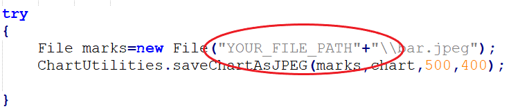
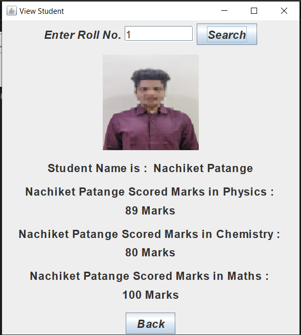

# Student-Management-System

This project consists of maintaining the record of every student and perform various statistics based on the marks scored by an individual by using Java SE , Hibernate ORM Framework, JFreeChart and  itextpdf.

## Hibernate ORM Framework

Hibernate is a Java framework that simplifies the development of Java application to interact with the database. It is an open source, lightweight, ORM (Object Relational Mapping) tool. Hibernate implements the specifications of JPA (Java Persistence API) for data persistence.

## JFreeChart

JFreeChart is a free 100% Java chart library that makes it easy for developers to display professional quality charts in their applications.

## How to Run:

1. <a href="https://www.oracle.com/in/java/technologies/javase-downloads.html" target="_blank">Download and install Java SE Development Kit 14 (JDK 14)</a>
2. <a href="https://www.oracle.com/database/technologies/xe-prior-releases.html" target="_blank">Download and install Oracle Database Express Edition (XE) Release 11.2.0.2.0</a>
3. <a href="https://github.com/Nachiket724/Student-Management-System.git" target="_blank">Download the GitHub Repository</a>
4. Login in to your Gmail Account and goto <a href="https://myaccount.google.com/lesssecureapps" target="_blank">Less secure app access</a> and allow the Less Secure Apps access.
  
5. Place the Repository in one specific folder.

6. Open <b>StudentManagementSystem/hibernate.cfg.xml</b> and change the <b>configuration</b> and keep your Oracle SQL Database password.
  
     
      
7. Create a new directory in which you want to save the files and images which are being fetch from the database.
8. Copy the path of that directory and paste it in the <b>StudentManagementSystem/SendAcknow.java</b>
  
     

     
     
     
     
9. Paste the Organization Email- ID and  Organization Password and paste it in the <b>StudentManagementSystem/EmailSender.java</b>
      
     
      
10. Copy the same directory path and paste it in the <b>StudentManagementSystem/SendAcknow.java</b>.
      
     
      
11. Open the Command Prompt in <b>Student Management System/StudentManagementSystem/</b>
12. In Command Prompt type <b>javac -cp required\* *.java</b> This will create the java class of all the files.
13. Then in Command Prompt type <b>java -cp required\*;. MainFrame" </b>.
14. Then Login will Open and type Username as <b>rait</b> and Password as <b>root.</b>
  
      
     
      
15. Just click <b>Login</b> and you are ready to run the project.
  
  
## Here are some Screenshots of the projects

